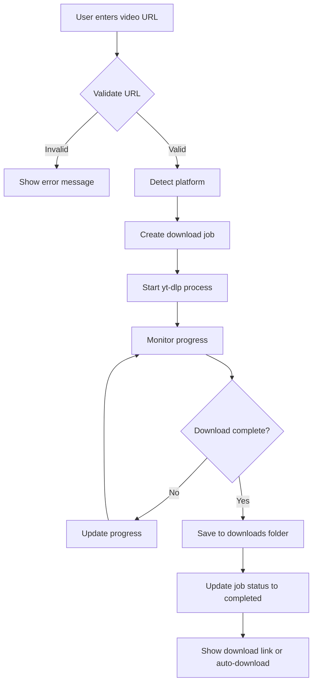
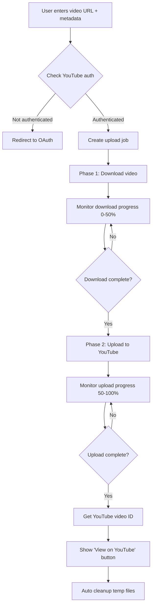
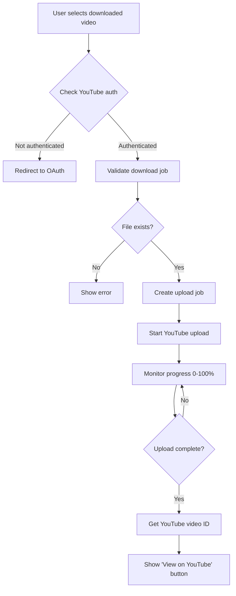
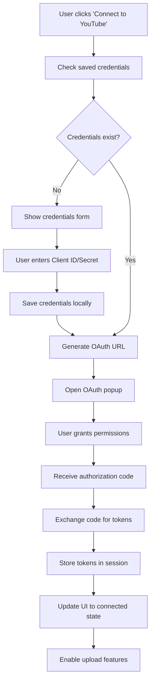

# Video Downloader & Uploader

A powerful, flexible web application for downloading videos from multiple platforms and uploading them to YouTube. Easily customizable for any domain with automated configuration.

## Key Features

- **Domain Flexible**: Works with any domain - automatically configures redirect URIs
- **Easy Setup**: Interactive setup script for quick configuration  
- **Docker Ready**: Containerized deployment with Docker and Docker Compose
- **Secure**: Local credential storage with multiple authentication options

## Features

### Download System
- **Multi-Platform Support**: YouTube, Instagram, TikTok, Facebook, Twitter, and more
- **Quality Selection**: Choose from best, 1080p, 720p, 480p, 360p
- **Download Modes**: Server download or direct download
- **Batch Download**: Download multiple videos simultaneously
- **Real-time Progress**: Live progress tracking with speed and ETA

### Upload System
- **Upload via Link**: Direct download and upload to YouTube
- **Upload from Downloaded**: Upload previously downloaded videos
- **Upload from Local Files**: Upload user's local video files
- **Multi-mode Interface**: Single card with mode switching
- **YouTube Integration**: Full OAuth2 authentication
- **Progress Tracking**: Two-phase progress for direct uploads

### Authentication & Security
- **YouTube OAuth2**: Secure authentication flow
- **Session Management**: Per-user token storage
- **Local Credentials**: Secure local credential storage
- **Auto Token Refresh**: Automatic token renewal
- **Security Headers**: CSP, CORS, and other security measures

### Management & Monitoring
- **Job History**: Complete download/upload history
- **Real-time Status**: Live job status tracking
- **Export/Import**: History data management
- **Auto Cleanup**: Automatic file and job cleanup
- **Error Handling**: Comprehensive error management

## Quick Start

### Prerequisites
- Node.js 18+ 
- npm or yarn
- FFmpeg (automatically detected or manually installed)
- yt-dlp installed globally
- YouTube API credentials (for upload features)

### Available Scripts
After installation, you can use these scripts:
- `./setup.sh` - Interactive setup for new installations
- `./install-deps.sh` - Install only Node.js dependencies and check system requirements
- `./start.sh` - Start the application with PM2
- `./stop.sh` - Stop the application  
- `./update.sh` - Update to latest version from git
- `./test-all-features.sh` - Run comprehensive tests

### Installation

1. **Clone the repository**
```bash
git clone https://github.com/mycoderisyad/video-downloader-uploader.git
cd video-downloader-uploader
```

2. **Quick Setup (Recommended)**
```bash
chmod +x setup.sh
./setup.sh
```

3. **Install FFmpeg (if not automatically detected)**

   **Windows:**
   ```powershell
   # Run as Administrator
   PowerShell -ExecutionPolicy Bypass -File install-ffmpeg-windows.ps1
   ```
   
   **Linux/Ubuntu:**
   ```bash
   chmod +x install-ffmpeg-linux.sh
   ./install-ffmpeg-linux.sh
   # or manually: sudo apt install ffmpeg
   ```
   
   **macOS:**
   ```bash
   brew install ffmpeg
   ```

4. **Manual Setup (Alternative)**
```bash
# Install dependencies only
./install-deps.sh

# Configure environment
cp env.example .env
# Edit .env with your configuration

# Create directories
mkdir -p downloads uploads temp logs batch exports data config
```

5. **Start the application**
```bash
./start.sh
# or manually: npm start
```

6. **Access the application**
- Local: http://localhost:3031
- Custom domain: Configure in CORS_ORIGINS environment variable

## Application Workflow

### Download Workflow



### Upload Workflow

#### Upload via Link Flow


#### Upload from Downloaded Flow


### Authentication Flow




### Key Components

#### Core Services
- **Video Controller**: Handles download operations
- **YouTube Controller**: Manages upload and authentication
- **Logger**: Centralized logging system
- **Job Manager**: Tracks and manages all operations

#### Data Flow
1. **Frontend** sends requests to REST API
2. **Controllers** process requests and manage jobs
3. **External Tools** (yt-dlp) handle video processing
4. **Storage** manages files and job data
5. **Real-time Updates** via polling mechanism

## API Documentation

Complete API documentation is available at `/api-docs` when the server is running.

### Key Endpoints

#### Download
- `POST /api/download` - Start video download
- `GET /api/download-status/:jobId` - Get download status

#### Upload
- `POST /api/upload-via-link` - Download and upload to YouTube
- `POST /api/upload-youtube` - Upload downloaded video
- `GET /api/upload-status/:jobId` - Get upload status

#### Authentication
- `GET /api/auth/youtube` - Initiate OAuth flow
- `POST /api/auth/status` - Check auth status
- `POST /api/auth/disconnect` - Disconnect from YouTube

## Configuration

### Environment Variables
```bash
# Server Configuration
PORT=3031
NODE_ENV=production

# YouTube API (Optional - can be set via UI)
YOUTUBE_CLIENT_ID=your_client_id
YOUTUBE_CLIENT_SECRET=your_client_secret
YOUTUBE_REDIRECT_URI=http://localhost:3031/api/auth/youtube/callback

# CORS Origins (configure your domain)
CORS_ORIGINS=http://localhost:3031,http://127.0.0.1:3031,https://yourdomain.com
```

### YouTube API Setup
1. Go to [Google Cloud Console](https://console.cloud.google.com/)
2. Create a new project or select existing
3. Enable YouTube Data API v3
4. Create OAuth 2.0 credentials
5. Add authorized redirect URI: `http://localhost:3031/api/auth/youtube/callback` (or your domain)
6. Enter credentials in the app's Settings tab or during setup

## Testing

### Automated Testing
Run comprehensive tests:
```bash
./test-all-features.sh
```

### Manual Testing
1. **Download Test**: Try downloading from different platforms
2. **Upload Test**: Test all three upload modes
3. **Auth Test**: Test YouTube authentication flow
4. **Error Test**: Test error handling with invalid inputs

## Deployment

### Production Deployment
```bash
# Using PM2
npm install -g pm2
./start.sh
pm2 startup
```

### Docker Deployment
```bash
# Using Docker Compose (Recommended)
docker-compose up -d

# Or build and run manually
docker build -t video-downloader .
docker run -d -p 3031:3031 video-downloader
```

### Manual Deployment
```bash
# Install dependencies
npm install --production

# Start server
npm start
```

## Monitoring

### PM2 Monitoring
```bash
pm2 status                 # Check process status
pm2 logs video-downloader  # View logs
pm2 monit                  # Real-time monitoring
```

### Health Checks
- Server health: `GET /`
- API health: `GET /api/auth/status`

## Development

### Local Development
```bash
# Install dependencies
npm install

# Start development server
npm run dev
# or
node server.js
```

### Code Structure
- **MVC Pattern**: Separation of concerns
- **RESTful API**: Standard HTTP methods
- **Error Handling**: Comprehensive error management
- **Logging**: Structured logging with Winston
- **Security**: CORS, CSP, and input validation

## Troubleshooting

### Common Issues

#### Download Issues
- **yt-dlp not found**: Install yt-dlp globally (`pip install yt-dlp`)
- **FFmpeg not found**: Run appropriate install script for your OS
- **Unsupported URL**: Check platform support
- **Network errors**: Check internet connection

#### FFmpeg Issues
- **Windows**: Run `install-ffmpeg-windows.ps1` as Administrator
- **Linux**: Run `install-ffmpeg-linux.sh` or use package manager
- **Path issues**: Set `FFMPEG_PATH` environment variable
- **Permission denied**: Check file permissions and PATH

#### Upload Issues
- **Authentication failed**: Check YouTube credentials
- **Quota exceeded**: YouTube API has daily limits
- **File not found**: Ensure download completed successfully

#### Server Issues
- **Port in use**: Change PORT in .env
- **Permission denied**: Check file permissions
- **Memory issues**: Monitor with `pm2 monit`

### Debug Mode
```bash
# Enable debug logging
NODE_ENV=development npm start
```

## Performance

### Optimization Features
- **Concurrent Downloads**: Multiple simultaneous downloads
- **Progress Streaming**: Real-time progress updates
- **Memory Management**: Automatic cleanup of temporary files
- **Caching**: Efficient job status caching

### Resource Usage
- **Memory**: ~20-50MB base usage
- **CPU**: Varies with concurrent jobs
- **Storage**: Temporary files auto-cleaned
- **Network**: Depends on video sizes


## License

This project is licensed under the MIT License - see the [LICENSE](LICENSE) file for details.

## Acknowledgments

- [yt-dlp](https://github.com/yt-dlp/yt-dlp) - Video downloading
- [Google APIs](https://developers.google.com/youtube) - YouTube integration
- [Express.js](https://expressjs.com/) - Web framework
- [Tailwind CSS](https://tailwindcss.com/) - UI styling
